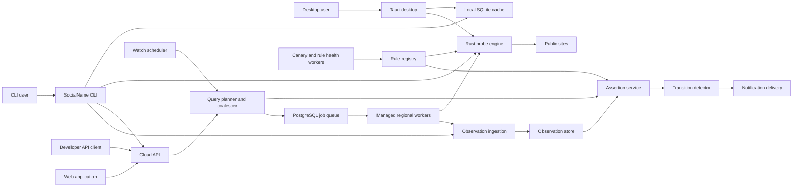

# System architecture

This architecture serves the authoritative
[SocialName ultimate goal](ultimate-goal.md). Implementation order and current
acceptance gates are maintained in [`ROADMAP.md`](../ROADMAP.md).

## Architectural goals

The system must:

- Use the same Rust domain and probe engine in the CLI and managed workers.
- Keep local execution useful when every SocialName service is unavailable.
- Stream partial results instead of waiting for the slowest site.
- Treat network results as time- and vantage-specific observations.
- Derive current assertions using freshness, provenance, and rule health.
- Protect the service and third-party sites from abusive workloads.
- Make client contribution and data visibility explicit.
- Begin as an operationally simple modular monolith.

## System overview



The boxes are logical modules. The first deployment does not require a
microservice for each box.

## Planes and responsibilities

### Client plane

The CLI and desktop shell depend on `socialname-app-core`, which owns:

- Rule-pack verification and local fallback.
- Query planning for local/cache/remote/hybrid modes.
- Local probe execution.
- Explicit synchronization policy.
- Machine-readable event streaming.

Each application owns its presentation and command boundary. The native desktop
shell, not its webview, resolves and opens the local SQLite observation cache.
The CLI owns command parsing, filesystem arguments, and normal/JSON output.
The application core owns the typed managed-search transport; the measurement
engine still imports no CLI, database, or cloud-API concerns.

### Control plane

The central control plane owns:

- Accounts, organizations, roles, and API keys.
- Plan entitlements, quotas, and billing integration boundaries.
- Site catalog and signed rule-pack publication.
- Watch definitions, schedules, and retention policies.
- Notification destinations.
- Audit logs and administrative controls.

### Data plane

The data plane owns:

- Search creation and idempotency.
- Source selection and freshness evaluation.
- Request coalescing and active-search single-flight behavior.
- Managed regional worker execution.
- Observation validation and ingestion.
- Current assertion derivation.
- Streaming partial results.

### Quality plane

The quality plane owns:

- Known-positive and generated-negative canaries.
- Regional rule health.
- WAF, site drift, and classifier-conflict detection.
- Rule quarantine and staged rollout.
- Client-source reputation and conflict escalation.
- Rule-pack rollback.

### Delivery plane

The delivery plane owns:

- State transition detection.
- Notification deduplication.
- Email and webhook delivery.
- Retry, dead-letter, and delivery audit.
- Later collaboration and incident-management integrations.

The implemented webhook and email boundaries use one channel-specific
database-logical delivery with a stable receiver/gateway deduplication ID and
at-least-once HTTPS attempts. Separate non-owner worker commands decrypt only
channel- and endpoint-bound destination envelopes. Webhooks sign the typed
confirmed transition; email derives a fixed plain-text message and submits it
to a provider-neutral HTTPS gateway. Both enforce public-only managed
networking and record fenced attempt/audit/lineage metadata without
destinations or bodies. External endpoint administration and production
provider evidence remain deployment gates. See
[Signed webhook delivery](webhook-delivery.md) and
[Email delivery](email-delivery.md).

## Query planning

Inputs:

- Username set and selected sites.
- Execution mode and synchronization policy.
- Maximum acceptable age.
- Required region or vantage policy.
- Tenant quota and watch priority.
- Current rule pack.

For each `(normalized username, site, region class, rule hash)` key:

1. Check the local cache when called from an eligible local client.
2. Check eligible private and shared assertions.
3. Reject observations produced by unhealthy or superseded rules.
4. Determine whether freshness requirements are satisfied.
5. If not, select local or managed execution according to mode.
6. Coalesce equivalent active work.
7. Stream observations as they complete.
8. Recompute assertions and transitions.

An interactive search may return a cached result immediately and continue to
refresh it. The API must distinguish `provisional`, `refreshing`, and `final for
requested policy`; it must not imply that Internet state is ever permanently
final.

The client implementation makes this concrete with a closed source/sync
matrix. `hybrid+never` emits local cache before invoking the local executor.
`hybrid+private/shared` emits the same eligible local-cache phase before a
managed search; `remote` goes directly to managed search. Managed clients
validate and resume the ordered SSE protocol, retain actual cloud/assertion/
probe origins, and turn cancellation into the existing idempotent API delete.
CLI machine output preserves the cache phase and ordered managed events; the
desktop streams the same phases through typed IPC. See
[Remote and remote-assisted clients](remote-clients.md).

## Observation and assertion model

### Observation

An observation is immutable:

```text
Observation
  id
  tenant_visibility
  normalized_username
  site_id
  verdict
  inconclusive_reason
  observed_at
  expires_at
  vantage_kind
  region
  producer_kind
  producer_id
  engine_version
  rule_pack_version
  rule_hash
  transport_summary
  evidence_summary
  evidence_digest
  ingest_status
```

`region` should initially be country or managed-region granularity. Exact
coordinates and client IP addresses are unnecessary for the product.

### Assertion

An assertion is derived and replaceable:

```text
Assertion
  key
  verdict
  freshness
  quality
  observed_at
  expires_at
  rule_hash
  region_scope
  regional_assertions
  supporting_observation_ids
  conflicting_observation_ids
  derivation_version
```

The assertion derivation version is stored because aggregation rules will
evolve independently from site rules.

### Quality is not a vague confidence percentage

Avoid presenting an unexplained `73% confidence`. Expose interpretable facts:

- Source class.
- Observation age.
- Rule health.
- Number and diversity of supporting observations.
- Whether managed verification exists.
- Whether evidence conflicts.

A small public quality enum may be derived from those facts:

- `verified`
- `corroborated`
- `single_vantage`
- `stale`
- `conflicted`
- `untrusted`

## Trust model

| Producer | Visibility | Shared assertion influence |
| --- | --- | --- |
| Local CLI with `sync=never` | Local only | None |
| Authenticated CLI with `sync=private` | Tenant only | Private assertion only |
| Authenticated CLI with `sync=shared` | Minimized shared pool | Hint/corroboration only |
| Anonymous client | Not accepted initially | None |
| Managed worker | Tenant or managed pool | Eligible |
| Controlled canary worker | Rule-health system | Eligible for health, not a user search |

### Why client signatures are insufficient

Each authenticated installation may hold its own key and sign an upload. This
provides source continuity and replay protection, but it does not attest that:

- The official binary ran.
- The HTTP request was actually sent.
- The response or location is genuine.

The service must use managed rechecks, source diversity, rate limits, anomaly
detection, and reputation rather than claiming desktop attestation.

### Conflict handling

When observations conflict:

1. Preserve all observations.
2. Check rule-version and freshness mismatches.
3. Check whether the difference is region-specific.
4. Mark the assertion conflicted rather than selecting the latest writer.
5. Schedule a managed verification if policy permits.
6. Suppress account-state alerts until the conflict is resolved or emit a
   distinct measurement-degradation alert.

## Central data model

Initial PostgreSQL tables:

| Table | Purpose |
| --- | --- |
| `tenants` | Users and team workspaces |
| `memberships` | Roles and workspace access |
| `api_keys` | Tenant-RLS API-key scopes, lifecycle, and audit metadata |
| `api_key_credentials` | Restricted public-prefix and secret-digest lookup |
| `clients` | Authenticated CLI installations and consent state |
| `sites` | Stable site identity and metadata |
| `rule_packs` | Published pack metadata, hashes, and rollout state |
| `rule_versions` | Per-site compiled rule revisions |
| `rule_health_records` | Region-specific health and quarantine history |
| `rule_pack_trust_roots` | Staged, active, and retired public threshold trust |
| `rule_pack_metadata` | Bounded signed release envelopes and rollout stages |
| `rule_pack_promotions` | Exact site/promotion bindings inside each release |
| `rule_pack_registry` | Durable active/staged/LKG state and global replay floor |
| `rule_site_promotion_high_water` | Durable per-site promotion replay floors |
| `consent_grants`, `consent_events` | Purpose-specific consent and immutable history |
| `searches` | User/API search requests, policy, and idempotency digest |
| `search_targets` | Stable requested target order and later site-specific normalization |
| `search_events` | Append-only ordered REST/SSE replay records |
| `probe_jobs` | Managed execution queue |
| `probe_job_consumers` | Search/watch consumers of equivalent work |
| `observations` | Append-only probe results |
| `evidence_capsules` | Closed structured evidence with database-time visibility deadlines |
| `evidence_retention_receipts` | Payload-free irreversible-purge receipts |
| `assertions` | Materialized current interpretation |
| `assertion_support` | Observation support and conflict lineage |
| `regional_assertions` | Immutable per-region projection of one global generation |
| `regional_assertion_support` | Observation support and conflict lineage per regional projection |
| `watches` | Monitoring configuration |
| `watch_targets` | Expanded monitored targets |
| `transitions` | Durable meaningful state changes |
| `transition_basis` | Observations supporting a transition |
| `notification_endpoints` | Email/webhook destinations |
| `notification_deliveries` | Delivery attempts and deduplication |
| `audit_events` | Security and administrative audit |
| `data_lineage_edges` | Withdrawal and recomputation lineage |
| `deletion_requests`, `deletion_tasks`, `deletion_receipts`, `deletion_backup_verifications` | Deadline-bound erasure workflow and backup evidence |
| `deletion_resource_matches` | Immutable hide/support/purge lineage tombstones |
| `suppression_tokens` | HMAC-only reingestion suppression with key identity |
| `deletion_restore_runs`, `deletion_restore_request_links` | Target-free replay proof and restore quarantine |

The large tables should use time-based partitioning only after observed volume
justifies it. PostgreSQL remains the source of truth for the first production
stage. The implemented constraints, forced tenant RLS contract, migration
command, and PostgreSQL 18 verification are specified in
[PostgreSQL schema and migration boundary](postgresql-schema.md).

### Data retention classes

- Local cache: user controlled.
- Private interactive Evidence Capsules: 90 days.
- Private monitoring Evidence Capsules: accepted 30–730 day watch setting.
- Shared structured Evidence Capsules: fixed 400 days.
- Shared-research excerpts: at most 30 days and never beyond structure.
- Transitions and audit: longer-lived than raw evidence.
- Shared client observations: minimized and separately consented.
- Raw response artifacts: off by default, encrypted object storage only when
  explicitly requested for debugging or evidence.

Central Capsule reads compare their deadline with database time before
returning payload. A bounded worker command irreversibly clears due research
and structure, writes payload-free three-year receipts, and later removes
expired receipts. Separate lineage-backed contributor/target workflows now
remove selected observation summaries and their primary dependencies. See
[Bounded Evidence Capsule v1](evidence-capsule-v1.md) and
[Lineage-backed deletion workflows](deletion-workflows.md).

Deletion must remove derived assertions when their supporting private
observations are deleted.

## API shape

### Authentication and workspace

```http
GET /v1/workspace
```

The first implemented private route accepts a strict bearer API key, performs
digest lookup without exposing the credential table, then rechecks active
tenant, key expiry/state, and `workspace:read` under a non-owner,
transaction-local forced-RLS connection. It returns workspace and nonsecret
authenticated-key metadata only. Bootstrap, key rotation, and revocation are
explicit audited operator commands rather than unauthenticated HTTP routes.
The complete boundary is specified in
[Authenticated private workspaces and API keys](authenticated-workspaces.md).

### Search

```http
POST /v1/searches
GET  /v1/searches/{search_id}
GET  /v1/searches/{search_id}/events
DELETE /v1/searches/{search_id}
```

`POST` requires a tenant-scoped idempotency key and purpose-specific consent,
persists the exact request/targets plus a `started` event transactionally, and
returns immediately. Exact replay returns the original search; different
content under the same key conflicts. Because posting a target already moves it
off-device, the managed route rejects `sync=never` and accepts only
`remote`/`hybrid`.

The events endpoint replays append-only PostgreSQL events by explicit sequence,
uses the SSE event UUID for `Last-Event-ID` resumption, rechecks authorization
while connected, and bounds each connection. Polling remains available for
simple clients. `DELETE` is idempotent cancellation and writes one terminal
event; erasure is a separate governed workflow. See
[Private search API and ordered event stream](search-api.md).

The signed worker now expands eligible pending targets under a narrow
cross-tenant coordinator function, then performs all tenant data work under
transaction-local forced RLS. Exact consent, visibility, normalized target,
site, rule version, and region define one active work scope. Fenced leases make
expired attempts unable to commit, and one transaction writes the immutable
observation, its closed Evidence Capsule, all consumer events, terminal search
state, and lineage. See
[Managed probe jobs and observation ingestion](managed-jobs.md).

### Consent

```http
POST /v1/consent-grants
GET  /v1/consent-grants
GET  /v1/consent-grants/{consent_grant_id}
POST /v1/consent-grants/{consent_grant_id}/withdrawals
```

The authenticated lifecycle keeps private history, shared observation, and
shared research independent and binds each grant to exact profile and notice
versions. Account subjects are derived from the active API-key membership.
Installation subjects persist only a tenant-separated digest and cannot be
overridden by another workspace membership. Creation is serialized and
replay-safe; withdrawal is immediate, one-way, evented, and distinct from the
separate lineage-backed deletion workflow. See
[Purpose-specific consent grant lifecycle](consent-api.md).

### Evidence inspection

```http
GET /v1/observations/{observation_id}/evidence-capsule
```

The route requires the independent `evidence:read` scope and returns only a
validated Capsule whose database-time structured deadline remains in the
future. Foreign, expired, purged, and unknown resources are uniformly hidden.
An optional research excerpt has its own shorter projection deadline. See
[Bounded Evidence Capsule v1](evidence-capsule-v1.md).

### Contributor and target-person deletion

```http
POST /v1/deletion-requests/contributor
GET  /v1/deletion-requests/{deletion_request_id}
GET  /v1/deletion-requests/{deletion_request_id}/receipt
```

An owner-authorized `data:delete` request uses an owned consent grant to select
one contributor subject/purpose, withdraws all matching grants, materializes
lineage tombstones, and hides/cancels target-bearing product state in the
creation transaction. A fenced worker withdraws support, recomputes from
remaining observations, and purges current PostgreSQL primary dependencies.

Externally verified target-person cases use a bounded stdin schema-owner
command rather than a self-asserted HTTP route. They affect exact matching
shared observations across tenants, retain private tenant records for explicit
controller routing, and leave HMAC-only future-reingestion suppression.
Primary and derived completion share one deletion transaction. Backup
completion requires a deadline-bound inventory attestation, while an
HMAC-authenticated target-free ledger reapplies suppression and hiding before a
restored runtime becomes ready. See
[Lineage-backed deletion workflows](deletion-workflows.md).

### Observation synchronization

```http
POST /v1/client-observations:batch
GET  /v1/assertions
```

The ingestion endpoint enforces explicit visibility, schema version, replay
protection, size limits, and per-client quotas. It does not accept complete raw
HTTP responses.

### Monitoring

```http
POST   /v1/watches
GET    /v1/watches
GET    /v1/watches/{watch_id}
PATCH  /v1/watches/{watch_id}
DELETE /v1/watches/{watch_id}
GET    /v1/watches/{watch_id}/transitions
GET    /v1/operations/report?window=24h
```

The implemented console consumes only these versioned same-origin resources.
Watch and transition pages are bounded and tenant-keyset paginated under
`watch:read`; delivery details reuse the public protocol resource and omit
destinations and attempt internals. A pasted scoped API key remains in page
memory and is dropped on reload or disconnect. Topcoat 0.4.0 was evaluated at
this replaceable boundary but not adopted because a second direct-data path
would duplicate Axum authentication and forced-RLS authorization. See
[Minimal monitoring console](monitoring-console.md).

The tenant-wide report uses the independent `operations:read` scope and one
database-time PostgreSQL statement under forced RLS. It keeps `no_data`,
`meeting`, and `breached` distinct for watch-run success, channel-specific
delivery success, channel-specific transition-to-delivery p95, and current
deletion-deadline health. Its backlog is current state while its terminal
cohorts use one of three closed windows; neither is presented as production
SLA evidence. See
[Operational reporting and software objectives](operational-reporting.md).

### Rules and health

```http
GET /v1/rule-packs/latest
GET /v1/sites
GET /v1/sites/{site_id}/health
```

The public API is versioned independently from the rule schema and rule-pack
format. The implemented wire-level contract and validation rules are recorded
in [Public protocol v1](protocol-v1.md).

## Rust workspace

Implemented workspace boundaries and planned inward-compatible additions:

```text
crates/
  socialname-domain/        verdicts, observations, assertions, identifiers
  socialname-rule-schema/   typed source and compiled rule models
  socialname-rule-compiler/ lint, compile, bundle, and migration
  socialname-engine/        templates, HTTP probes, classifiers, scheduling
  socialname-cache/         local SQLite cache and freshness policy
  socialname-app-core/      UI-independent local search orchestration
  socialname-cli/           CLI binary
  socialname-protocol/      versioned API, event, watch, and delivery DTOs
  socialname-server/        Axum/Tower modular-monolith process boundary
  socialname-testkit/       mock sites, fixtures, deterministic clocks
  socialname-worker/        signed managed probe worker binary
rules/
  sites/
  fixtures/
schemas/
web/
apps/
  desktop/                  Tauri shell and React presentation
  console/                  same-origin monitoring presentation
```

Crate dependencies should point inward: CLI, server, and worker depend on the
domain and engine; the engine does not depend on those applications.

## Technology choices

### Core and network

- Rust stable MSVC-compatible toolchain.
- Tokio for asynchronous execution, timers, cancellation, and bounded channels.
- reqwest with rustls for HTTP, one reusable client per transport policy rather
  than one client per site.
- Serde for typed serialization.
- A safe, bounded regular-expression engine; no backtracking expressions from
  rule data.
- URL-component-aware templates instead of raw string replacement.

### Server

- Axum and Tower for REST, SSE, middleware, limits, and tracing.
- SQLx with PostgreSQL.
- A PostgreSQL-backed job queue using transactional claims and
  `FOR UPDATE SKIP LOCKED` initially.
- No Kafka, NATS, or Redis as a source of truth in the first release.
- In-process bounded caches and request coalescing; Redis may be added for
  cross-instance coordination only when multiple API instances require it.

### Client storage

- SQLite through SQLx.
- Schema migrations embedded in the CLI.
- Local retention and pruning commands.
- Optional OS key-store integration for cloud credentials.

### Rule distribution

- Human-authored strict YAML.
- Typed compilation to canonical JSON.
- Canonical content hashes plus domain-separated threshold-Ed25519 update
  metadata containing exact regional site promotions.
- At-most-24-hour expiry, canary/regional/general selection, persistent global
  and per-site rollback protection, retained last-known-good state, and
  dual-threshold key rotation.
- Candidate trust remains staged until general activation or signed rollback,
  so evaluating a new root cannot strand the current active pack.
- zstd remains an optional future transport encoding; it cannot change the
  canonical content identity or verification order.
- An embedded last-known-good pack for offline service operation.

The implemented artifact, state machine, operator command, PostgreSQL
registry, and worker binding are specified in
[Signed Rule-Pack Distribution v1](rule-pack-distribution-v1.md).

### Web and operations

- TypeScript and React with a small Vite monitoring application consuming the
  versioned same-origin API.
- Deterministic OpenAPI 3.1.2, Draft 2020-12 roots, exact SSE semantics, and a
  digest manifest generated from protocol types and a closed operation
  registry, with committed-artifact and Axum route/scope drift tests.
- OCI images for server and worker deployment. The first provider-neutral,
  one-shot worker artifact and its external regional evidence gate are defined
  in [Regional managed-worker deployment boundary](regional-worker-deployment.md).
- Managed PostgreSQL and S3-compatible encrypted object storage.
- OpenTelemetry-compatible tracing and metrics, with careful username
  redaction.
- `cargo fmt`, Clippy, tests, `cargo audit`, and `cargo deny` in CI.

Exact crate versions and hosting providers are implementation decisions, not
architectural commitments.

## Worker scheduling and scale

### Initial stage

- One API/server deployment.
- One PostgreSQL cluster.
- One or more worker processes with region labels.
- PostgreSQL job claims.
- SSE directly from API instance using database-backed state.

### Scale triggers

Introduce more infrastructure only when a measured trigger appears:

| Trigger | Possible change |
| --- | --- |
| API instances cannot coordinate active-search single-flight | Redis or a dedicated coordinator |
| PostgreSQL job claims become a material bottleneck | NATS JetStream or another durable broker |
| Observation analytics dominate transactional queries | Replicated analytics store such as ClickHouse |
| SSE fan-out is too large | Dedicated event gateway |
| Regional data residency is contractually required | Regional stores and tenant placement |

Microservices are not a prerequisite for a distributed measurement system.

## Security boundaries

### Managed probe SSRF protection

The local engine already requires HTTPS, validates request and redirect hosts
against the compiled rule, rejects literal private/loopback destinations, and
enforces bounded redirects, total time, and inspected body bytes.

The first managed worker boundary now guarantees:

- only signed rules from the registry execute;
- hostname resolution rejects private, loopback, link-local, metadata, and
  reserved addresses;
- DNS answers are pinned or revalidated at connect and redirect time to prevent
  rebinding;
- compressed, decompressed, and parsed-header byte budgets are enforced below
  the classifier;
- user API input can select known sites but cannot provide arbitrary probe
  URLs.

It also disables ambient proxies and independently caps raw response headers,
wire-compressed bytes, decompressed bytes, and matcher-inspected bytes. The
exact signed activation, resolver, address, and direct one-shot operator are
documented in [Signed managed worker boundary](managed-worker.md). Job
eligibility, forced-RLS coordination, coalescing, consent locking, retries, and
atomic ingestion are documented in
[Managed probe jobs and observation ingestion](managed-jobs.md).

### Sensitive evidence

- Never persist cookies, authorization headers, or complete request headers.
- Redact reflected usernames only when product behavior permits; otherwise
  classify the stored value as public-identifier personal data.
- Do not put usernames in metrics labels, trace attributes, or normal logs.
- Limit body reads and retain only matcher-relevant excerpts or hashes.
- Encrypt private data at rest and keep tenant authorization checks in the data
  access layer.

### Abuse controls

- Tenant and API-key quotas.
- Global and per-site concurrency/rate limits.
- Target-site circuit breakers.
- Idempotency and active-work coalescing.
- Monitoring minimum intervals.
- Site exclusions and emergency kill switches.
- An acceptable-use policy and abuse-response process before public API launch.

## Key architectural decisions still to prove

The first vertical slice must measure:

- Whether PostgreSQL alone is sufficient for jobs and streaming coordination.
- Rule-pack parse/startup cost versus embedding a precompiled representation.
- Local SQLite overhead and safe pruning.
- Cache hit rates under realistic freshness policies.
- How often local and managed vantages disagree.
- The minimum evidence needed to revalidate a client observation safely.
- Whether SSE survives the expected long-tail search duration and client count.
