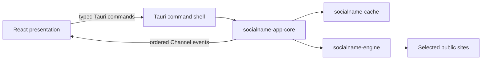

# Desktop application

## Decision

SocialName uses **Tauri 2 with React, TypeScript, and Vite** for the Windows
and macOS desktop application. The probe engine, rule compiler, and application
orchestration remain Rust libraries linked into the process. The webview owns
presentation only.

This decision is independent from the server-side monitoring console. Topcoat
can still be evaluated at that replaceable web boundary without placing an
experimental server UI framework inside the desktop client.

## Why Tauri

The performance-sensitive work is network scheduling, bounded response
inspection, classification, and rule evaluation. Those paths already run in
Rust. Reimplementing two native user interfaces would not make them faster, but
would split accessibility, design, and release work between AppKit/Swift and
WinUI/C# or C++.

Tauri gives the project:

- one native Rust process with the existing engine linked directly;
- the operating system webview instead of a bundled browser runtime;
- a mature Windows and macOS packaging path;
- a narrow typed IPC boundary with ordered streaming channels;
- a productive UI layer suitable for search, evidence inspection, monitoring,
  history, and notification configuration.

Slint remains a credible option for a small fully-Rust utility UI, especially
where webview availability is unacceptable. It is not selected because the
planned product is a data-dense monitoring application and the React
accessibility, testing, component, and hiring ecosystems provide more value
than avoiding a small presentation runtime.

## Process and trust boundary

There is no localhost HTTP server between the UI and engine. The initial shell
registers only four commands:

- `get_app_info`
- `list_sites`
- `start_search`
- `cancel_search`

The capability attached to the main window grants no plugin permissions.
The content security policy blocks arbitrary scripts, frames, objects, forms,
and network connections from the webview. The UI cannot issue arbitrary HTTP,
filesystem, database, or shell operations. Profile links are displayed as
evidence but are not opened through a generic shell capability.

The command shell validates bounded search identifiers. The application core
validates usernames, selected site count, known site IDs, and explicit research
mode before executing. Dropped event channels cancel the corresponding search.

The shell resolves its application-local data directory and opens
`observations.sqlite3`. The path is never sent to the webview. If directory
creation, ownership validation, migration, or integrity checking fails,
`get_app_info` reports cache mode unavailable while independent local probing
remains available. A cache lookup never falls through to the engine.

## Implemented client product slice

The implemented desktop slice supports:

- the embedded ten-site Site Rule v1 pack;
- selecting and filtering sites;
- explicit opt-in before discovery-only rules can execute;
- fully local probes with a maximum of eight concurrent sites;
- independent, visible `local`, `cache`, `remote`, and `hybrid` source controls
  plus `never`, `private`, and `shared` sync controls with a closed relation;
- device-only cached-first `hybrid+never` and remote-assisted cached-first
  `hybrid+private/shared`;
- immutable local observations with distinct `local_desktop` producer lineage;
- cache eligibility bound to exact target, region, rule hash, promoted rule,
  fresh healthy rule evidence, expiry, and requested maximum age;
- a site-level result envelope that keeps the full cached observation set
  separate from an optional live result;
- visible source, refresh state, observed time, expiry, region, rule hash, and
  rule-health state;
- ordered streaming of results and matcher evidence;
- cancellation while retaining completed results;
- dark and light system themes;
- reduced-motion and keyboard-focus behavior;
- visible requested source, actual result origin, and sync policy;
- session-only managed API origin, key, consent grant, and region inputs, with
  an additional acknowledgement for `shared`; and
- bounded, redirect-free managed creation, resumable SSE, and confirmed remote
  cancellation through app-core.

No production rule-health record or signed promoted pack is bundled, so all ten
repository rules remain discovery-only and offline cache lookup reports
`rule_not_promoted`. This preserves the external live-acceptance gate instead of
turning stored discovery observations into trusted cached results.

In device-only `hybrid`, app-core emits the cache phase before invoking the
local executor. With `private` or `shared`, it emits the cache phase before
creating a managed search and replaces the card with the typed remote result
while retaining eligible cached observations. Requested mode, sync, and actual
event origin remain distinct. Closing the event channel cancels local work or
requests idempotent remote cancellation. Credentials remain in application
memory and are not persisted in the cache. See
[Remote and remote-assisted clients](remote-clients.md).

## Platform policy

Windows packaging initially uses a per-user NSIS installer and Tauri's default
downloaded WebView2 bootstrapper behavior. Windows 11 normally already includes
the WebView2 runtime, while the bootstrapper keeps installation recovery
available.

macOS packaging produces an application bundle and DMG with macOS 12 as the
minimum supported system. CI compiles the native architecture on both Windows
and macOS. Universal macOS release artifacts, Windows and Apple code signing,
notarization, and update metadata are release-engineering gates and are not
silently simulated by development builds.

## Next desktop slices

1. Add private history and exports against the authenticated API.
2. Add watches, transition history, and notification configuration against the
   central API.
3. Add narrowly validated profile opening and export commands rather than
   generic webview capabilities.
4. Add component tests, IPC contract generation, and signed release pipelines.
